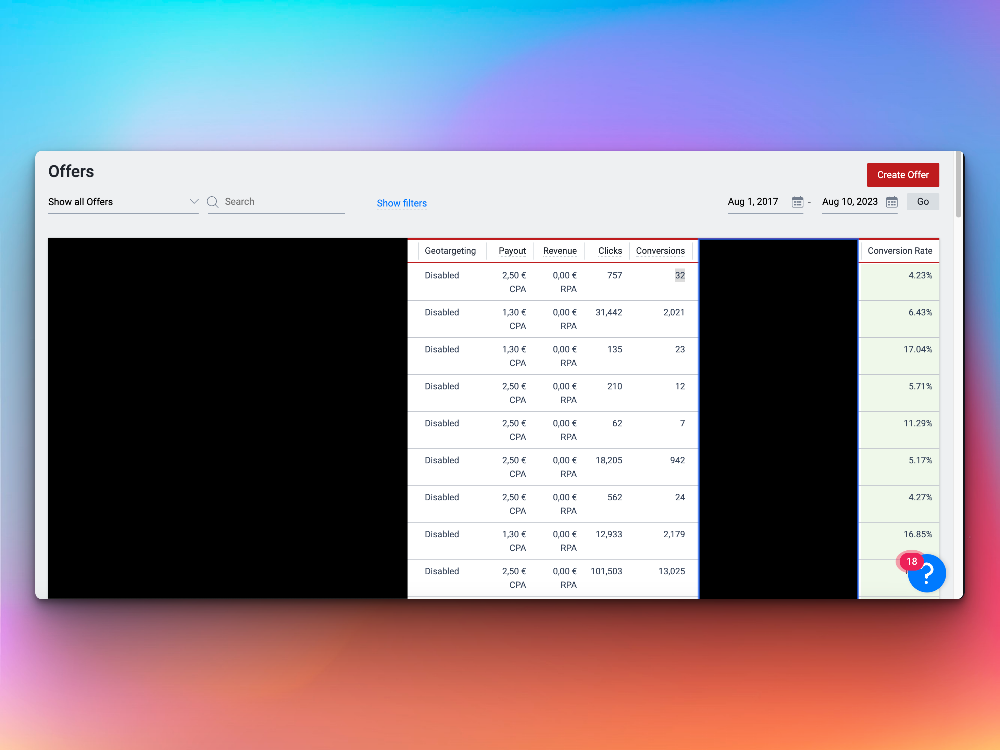

# HasOffers Applications Data Analysis Script

This repository contains a JavaScript script that enhances data analysis in HasOffers Applications. The script calculates the Conversion Rate for each offer in the provided table, which helps to better understand Key Performance Indicators (KPIs) and performance metrics.

## Table of Contents

- [Overview](#overview)
- [Usage](#usage)
- [Result](#result)
- [Installation](#installation)
- [Contributing](#contributing)
- [License](#license)

## Overview

The provided JavaScript script automates the calculation and display of the Conversion Rate in the HasOffers Applications table. It adds a "Conversion Rate" column to the table and fills in the calculated values for each offer based on the Clicks and Conversions data.

## Usage

1. Open the HasOffers Offers Page ( admin/offers ) Applications page with the relevant data table.
2. Open the browser's developer console.
3. Copy and paste the JavaScript script from this repository into the console.
4. Press Enter to execute the script.

The script will generate a new "Conversion Rate" column in the table, displaying the calculated Conversion Rate for each offer.

## Result

The resulting table will display the Conversion Rate for each offer, providing a valuable insight into the performance metrics. The Conversion Rate is calculated as the ratio of Conversions to Clicks, represented as a percentage.

## Installation

To use this script in your HasOffers Applications, follow these steps:

1. Copy the JS code
2. Customize the script if needed.
3. Open the HasOffers offers Page Applications page with the data table.
4. Open the browser's developer console.
5. Copy and paste the modified JavaScript script into the console.
6. Press Enter to execute the script.

## Contributing

Contributions are welcome! If you find any issues or want to improve the script, please create an issue or pull request in this repository.

## License

This project is licensed under the MIT License - see the [LICENSE](LICENSE) file for details.

Rudy Bekker